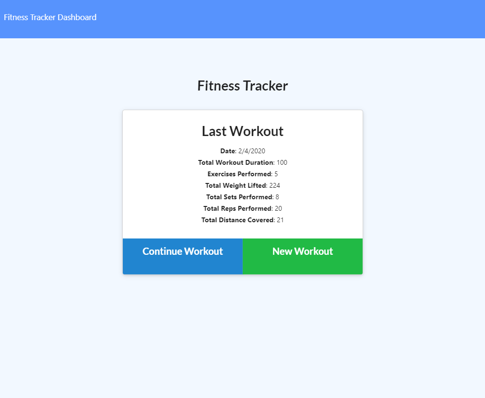
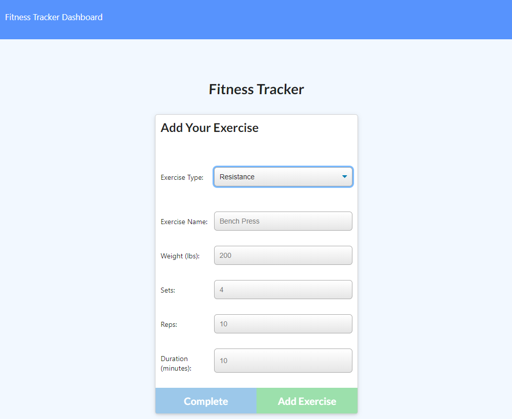
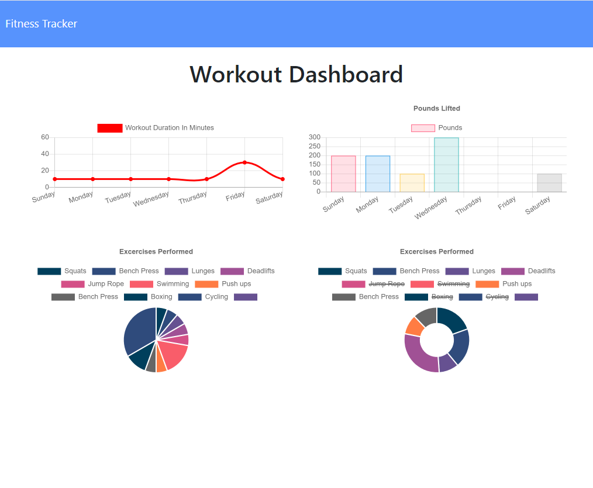

# Workout Tracker

This is an Express web application using Mongo database with a Mongoose schema.

When a user loads the page, they are given an option to create a new workout or continue with their last workout. The user should be able to:

- add exercises to a previous workout plan
- add new exercises to a new workout plan
- view the combined weight of multiple exercises on the `stats` page

## User Story

As a user, I want to be able to view, create and track daily workouts. I want to be able to log multiple exercises in a workout on a given day. I should also be able to track the name, type, weight, sets, reps, and duration of each exercise. If an exercise is a cardio exercise, I should be able to track my distance traveled.

## Business Context

A consumer will reach their fitness goals quicker when they track their workout progress. This app is deployed on [Heroku](https://track-workout.herokuapp.com).
---

---

---

